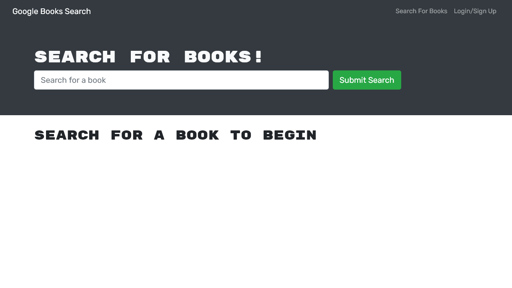

# Google Book Search - MERN App

This project demonstrates the use of the MERN stack and includes GraphQL to make queries between client and server

## Table of Contents

1. [Installation](#installation)
1. [Usage](#usage)
   1. [Screenshots](#screenshots)
1. [License](#license)
1. [Contributing](#contributing)
1. [Tests](#tests)
1. [Questions](#questions)

## Installation

npm i

## Usage

Once dependencies are installed, run 'npm build' to build the client and then deploy to Heroku in the regular way

### Screenshots

[Live Deployed Link](https://iron-gold-silver.herokuapp.com/)

### Mobile

### Browser

## Contributing

n/a

## Tests

n/a

## Questions

[Find me on Github](https://github.com/tbellenger)

Or you can contact me at tbellenger@gmail.com if you have any questions
